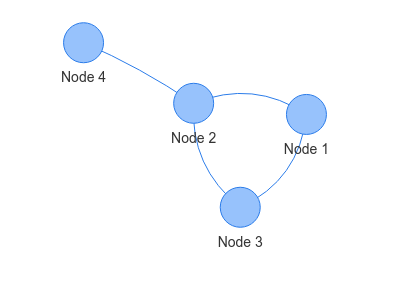
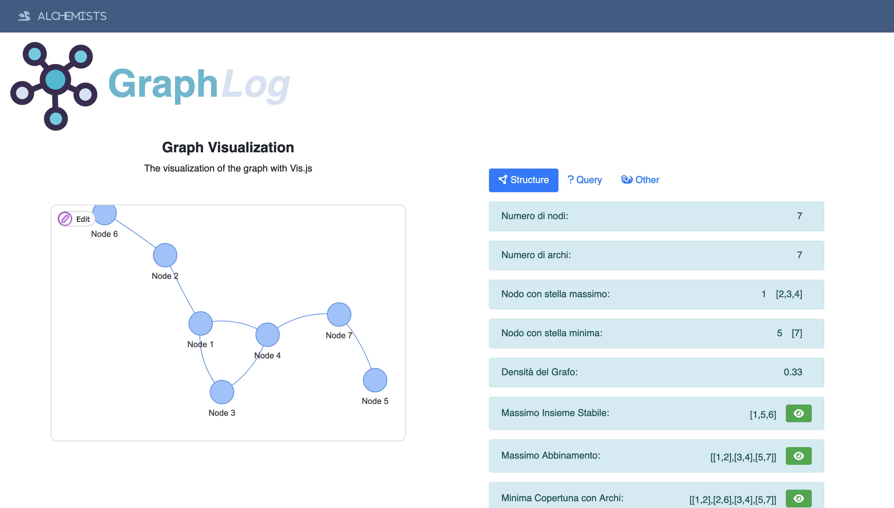
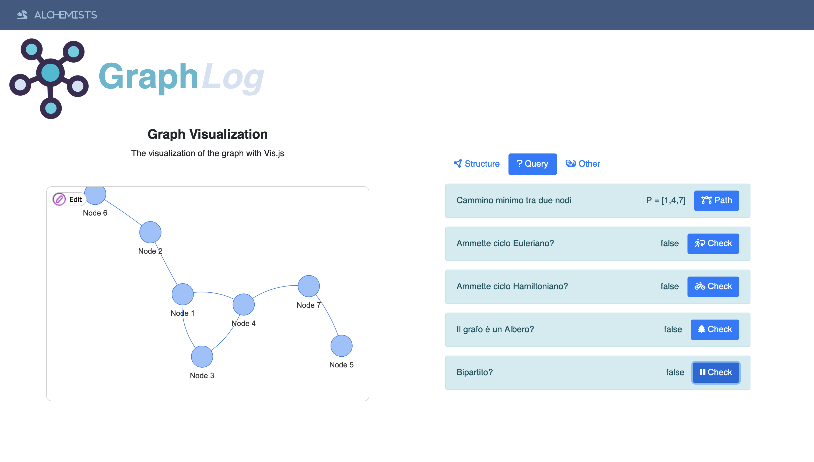

---
title:
- Progetto IA:Graphlog
author:
- Davide De Zuane, Rahmi El Mechri
---

# Idea 

+ Utilizzare prolog per analizzare i grafi
+ Rendere il progetti disponibile sul web
+ Fornire un interfaccia user friendly
+ Unire le conoscenze di IA con Ricerca Operativa

# Natura dell'Ambiente

## Descrizione
+ Ambiente: Teoria dei grafi
+ Metriche di performance: tempi di esecuzione
+ Attuatori: interprete prolog
+ Sensori: interfaccia utente

## Proprietà

+ Completamente Osservabile
+ Agente singolo
+ Deterministico
+ Episodico
+ Semi-statico
+ Discreto

# Agente

+ Simple reflex
+ Percezione: grafo caricato dall'utente
+ Azione: calcolo principali caratteristiche del grafo

# Tecnologie

Abbiamo realizzato una Single Page Application.
Per realizzarla ci siamo serviti delle seguenti librerie:

+ { height=20px } Tau-prolog: libreria javascript interprete prolog
+ { height=20px } Vis.js: libereria javascript per la visualizzazione di grafi

{ height=150px }
{ height=150px }

# Knowledge Base

La Knowledge Base è definita da due parti.

## Fatti
I fatti vengono generati dinamicamente a partire dal grafo definito dall'utente, e sono definiti nel seguente modo:

+ `node(x).`
+ `edge(x,y).`

## Regole
Le regole vengono importate da un file prolog presente nel web server. Nel definire le regole abbiamo considerato solamente grafi simmetrici, tramite le regole:

+ `edge_s(X,Y) :- edge(Y,X).`
+ `connected(X,Y) :- edge_s(X,Y); edge(X,Y).`

# Regole - 1

## Stable set
{ height=100px }\

## Matching
{ height=180px }\

# Regole - 2

## Edge Cover

{ height=150px }\

## Vertex Cover

{ height=150px }\

# Regole - 3
## Eulerian
{ height=150px }\

## Hamiltonian
{ height=150px }\

# Regole - 4
## Tree
{ height=150px }\

## Biparted
{ height=150px }\

# Regole - 5

Abbiamo inoltre definito le seguenti regole che fungono da **utility** per le altre:

+ `intersection\3`
+ `subtraction\3`
+ `last\2`
+ `same\2`
+ `ordered\1`
+ `arrays_dont_intersect\1`
+ `subset\2`

# Javascript

Abbiamo dovuto realizzare le seguenti funzioni in Javascript:

+ Parsare un file JSON contente i fatti.
+ Importare le regole dal file prolog.
+ Creare il grafo in vis.js a partire dai fatti.
+ Interfacciare i componenti dell'interfaccia alle query in prolog.
+ Iniettare i risultati all'interno dell'interfaccia
+ Creare un grafo randomico.

# GUI - 1
{ height=500px }\

# GUI - 2
{ height=500px }\

# GUI - 3
{ height=500px }\

# Considerazioni

Prevediamo l'aggiunta delle seguenti funzionalità, già parzialmente implementate:

+ Rendere l'ambiente semi-dinamico (aggiunta dinamica di nodi e archi)
+ Analisi di grafi orientati
+ Analisi di grafi pesati
+ Visualizzazione dei risultati delle query sul grafo
+ Animazione esecuzione query

# Ringraziamenti

\centerline{\bf Grazie per l'attenzione!}
